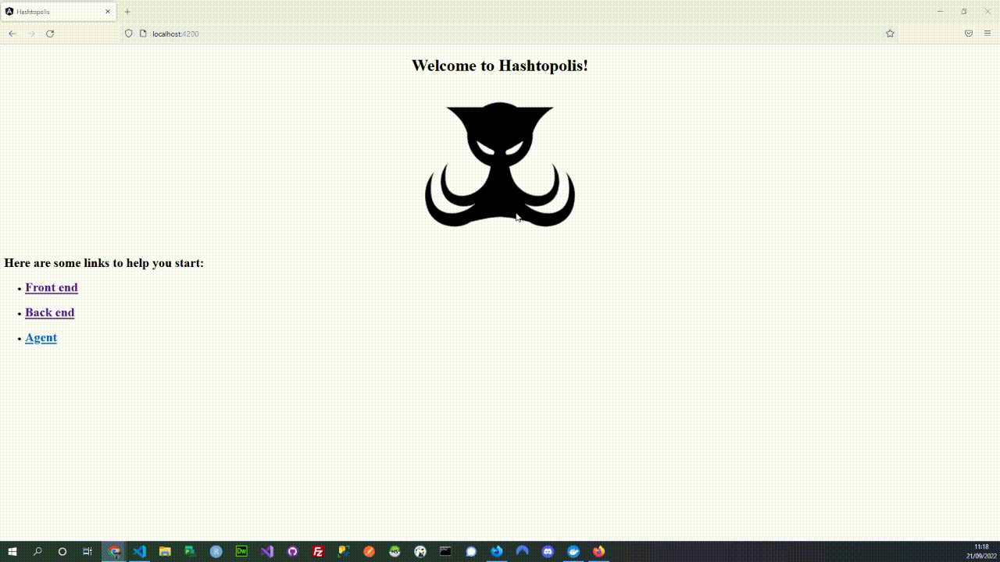

# Hastopolis UI
This project is for the developers working in Hashtopolis UI. Front End is developed using Angular.JS

# Installation and set up
1) Install Docker App (Windows, Linux, Mac) [here](https://docs.docker.com/engine/install/)
2) Git Clone project
Copy details below :

    git clone https://github.com/xbenyx/uihashtopolis.git

3) Go to the root folder project and run docker
Copy details below :

    docker-compose up

4) In project create, requirements.txt, Dockerfile (to create the container), dockerignore (what we do not need)
5) We create a folder called app
6) We build the container cmd: docker build . (Dot is important, defines the folder installation)
7) Create docker-compose.yml to define version and services the build cmd: docker-compose build

# Linting and Testing

Copy details below :

    @lxpanel --profile LXDE-pi
    @pcmanfm --desktop --profile LXDE-pi
    @xscreensaver -no-splash
    @point-rpi

    @xset s off  # Disabled screensaver
    @xset /dpms   # Disabled DPMS
    @xset s noblank # Dont blank the video device
    @chromium-browser --noerrors --disable-session-crashed-bubble --disable-infobars --kiosk --incognito http://localhost:3000/lounge    #If page is open in incognito mode cache is ignored

# Steps Create a project

1) Create project, note the dot is important otherwise will create the directory in the wrong path cmd:  docker-compose run --rm app sh -c "hashtopolis-admin startproject app ."
2) Now we start services in docker using the command cmd: docker-compose up

# Setting up automation using Github actions

This is similar than other tools such as Jenkins or Travis-CI (Free version but goog version cost approx €800 yearly). These tools have some usefuls features such as; app deployment, code linting or unit tests. Apps that help deployment AWS, Terraform or own VPS server. We will be setting up a Trigger to push to Github and run unit tests.

1) Create a folder in root and called it .github then a folder inside called workflows and inally a file checks.yml ( doesnt matter the name only as soon as it is inside the directory)
2) checks.yml, start with --- that means that is a yaml file
https://github.com/marketplace/actions/docker-login
https://github.com/marketplace?type=actions

### Common Errors
